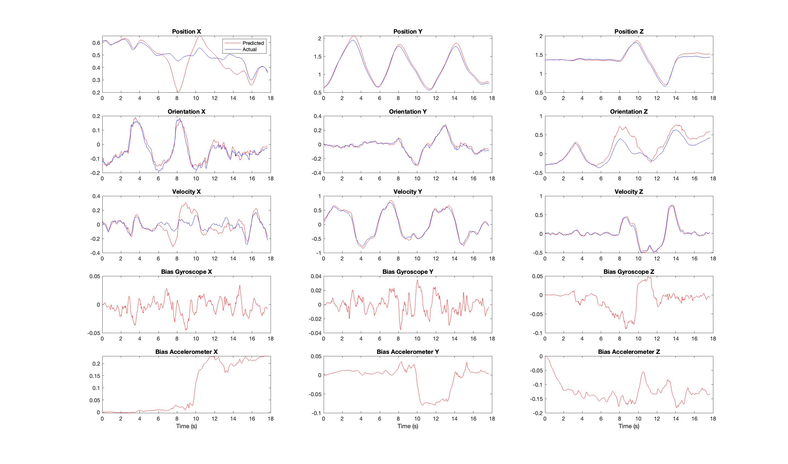

# Project-3-UKF
Implementation of Unscented Kalman Filter to estimate state of quadrotor using optical flow and IMU.

## Setup
Download the [dataset](https://drive.google.com/uc?export=download&id=1IVhh4lF6xcP7BuDsRNfJ9aH8xVaXKZBn) and extract it inside the `data` folder.
## Part 1
Computed state of quadrotor using the corner extraction from April Tags.

### Results

 

## Part 2
State estimation of quadrotor using optical flow using ORB and KLT tracker.

### Results

 

## Report
To read a detailed report, click [HERE](assets/Report.pdf).
