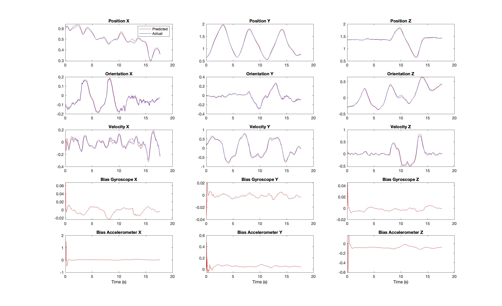

# Project-3-UKF
Implementation of Unscented Kalman Filter to estimate state of quadrotor using optical flow and IMU.

## Setup
The dataset required for this project is stored in the [data](data) directory and managed using **Git LFS**.

Clone the repository with Git LFS enabled:

```bash
git lfs install
git clone https://github.com/jagennath-hari/Project-3-UKF
```

If you cloned the repo without LFS enabled, run:
```bash
git lfs pull
```

## Part 1
Unscented Kalman Filter for fusing IMU data with pose(position and orientation) from optical flow.

### Results
<p align = 'center'></p> 

## Part 2
Unscented Kalman Filter for fusing IMU data with twist(velocity) from optical flow.

### Results
<p align = 'center'></p> 

## Report
To read a detailed report, click [HERE](assets/Report.pdf).
